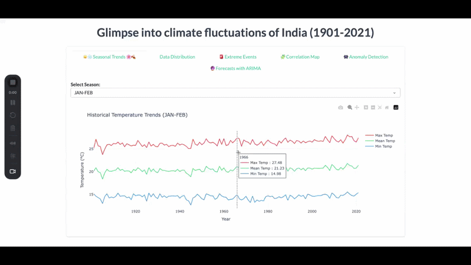
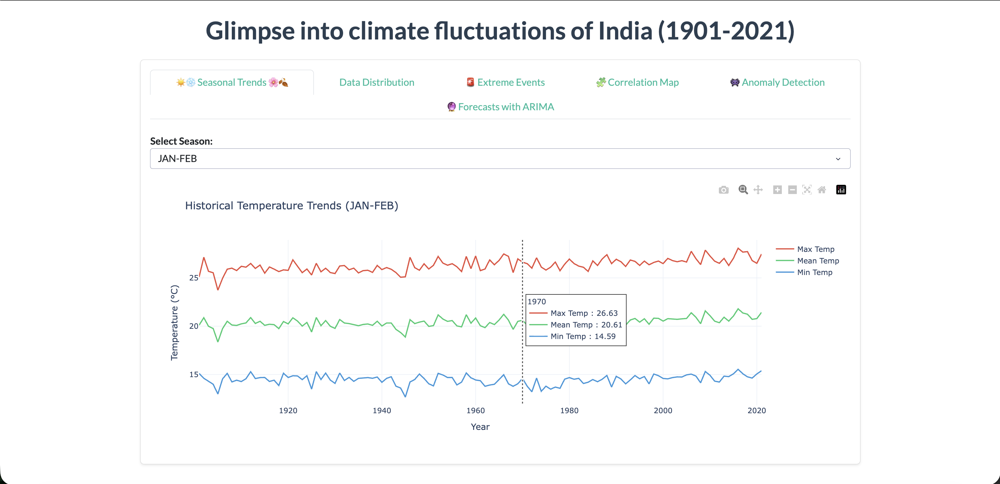
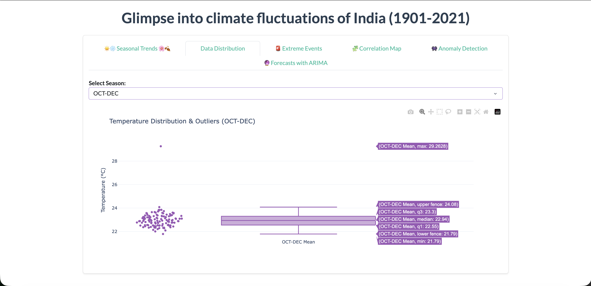
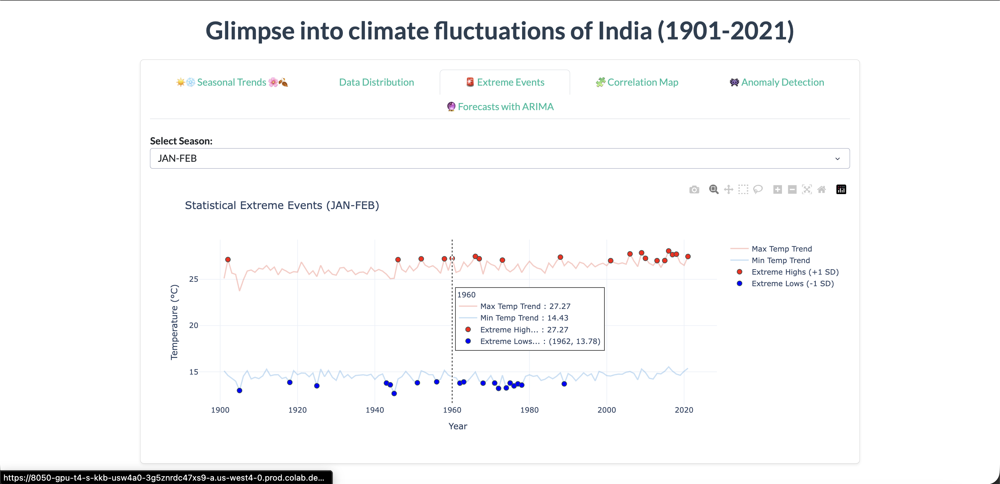
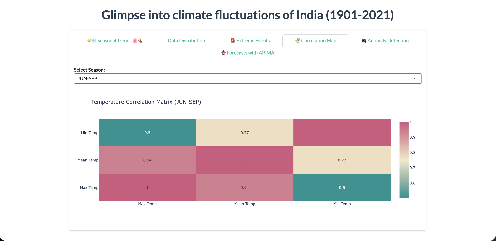
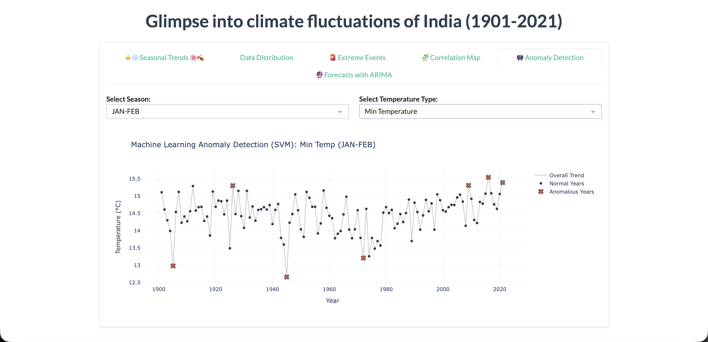
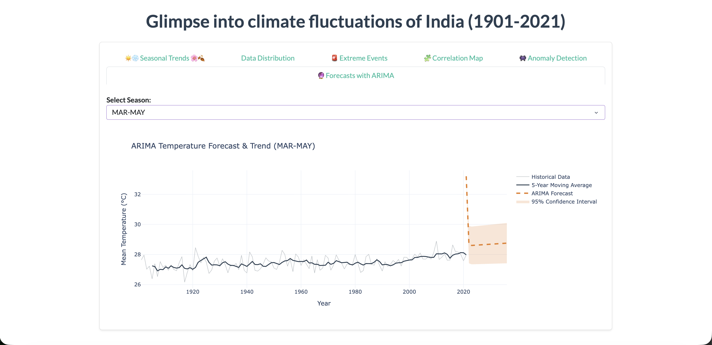

# India's-Temperature-Forecast
# 🌡️ India Climate Fluctuations: A Century of Change (1901-2021)

## 📋 Project Overview

Climate change is often discussed in abstracts, but this project moves beyond theory by using **Machine Learning and Time-Series Forecasting** to analyze 120 years of localized temperature data in India. 

The goal of this project was to move away from basic historical tracking toward a functional, data-driven tool that identifies "statistical breaks" in our climate history. By processing records from 1901 to 2021, this dashboard visualizes how seasonal boundaries are shifting—providing the evidence needed to move urban planning from reactive responses to proactive, data-backed strategies.

## 🏗️ Technical Implementation

I built this end-to-end pipeline to transform raw, century-old atmospheric data into an interactive intelligence platform:

* **Data Engineering & Imputation:** Built a robust cleaning pipeline (Pandas) to ingest and chronologically align three massive datasets covering **Maximum, Minimum, and Mean temperatures**. I engineered seasonal features—JAN-FEB, MAR-MAY, JUN-SEP, and OCT-DEC—to capture the specific volatility of the Indian climatic cycle.
* **Behavioral Anomaly Detection (SVM):** Deployed an **Unsupervised One-Class Support Vector Machine (SVM)** to isolate "climatic outliers". Unlike standard static thresholds, this ML model learns the complex distribution of temperatures over 120 years, flagging years like 1905, 1945, and 1971 as "Anomalous Years" based on their deviation from the learned historical norm.
* **Predictive Trajectory Modeling:** Built a **Seasonal ARIMA** model to forecast mean temperatures 15 years into the future. The model is tuned with a trend component and a 5-year moving average to project climate shifts through the 2030s, providing a 95% confidence interval for long-term planning.
* **Interactive UI/UX:** Designed a responsive, multi-tab frontend (Dash, Plotly, Bootstrap) that allows for hyper-local seasonal exploration and real-time statistical evaluation.

## 📊 Dashboard Deep Dive & Visual Evidence

| Feature Component | Visual Reference | Technical Insight |
| :--- | :--- | :--- |
| **Historical Trends** |  | Analysis of the **JAN-FEB** cycle reveals a critical baseline; by 1970, mean temperatures stabilized at **20.61°C** before beginning a steady modern climb. |
| **Distribution & Outliers** |  | Statistical spread for the **OCT-DEC** cycle shows a median of **22.94°C**, with extreme "Upper Fence" events pushing as high as **29.26°C**. |
| **Extreme Event Tracking** |  | By tracking years that exceed **±1 Standard Deviation**, the dashboard reveals a significant cluster of "Extreme Highs" post-2000 compared to the early 20th century. |
| **Feature Correlation** |  | The matrix confirms a **0.94 correlation** between Mean and Max temps, while **Min Temps** show higher volatility ($0.5$), indicating nights are warming at a different rate than days. |
| **ML Anomaly Detection** |  | The **SVM model** isolates specific years as statistical anomalies (marked with red 'X'), successfully filtering noise from actual climatic shifts. |
| **Predictive Forecast** |  | The **ARIMA trajectory** for the pre-monsoon (MAR-MAY) season indicates a tightening confidence interval around a new, higher temperature baseline for the next decade. |

## 💡 Key Takeaways

* **Leading Indicators:** Specific atmospheric markers in the pre-monsoon (MAR-MAY) season act as early-warning signals for broader annual temperature spikes.
* **Nighttime Volatility:** The lower correlation between Min and Max temperatures ($0.5$) proves that city-wide blanket policies are less effective than neighborhood-specific strategies that account for nighttime heat retention.
* **Historical Reliability:** The SVM-driven anomaly detection successfully identifies historical "cold-shocks" (like the 1940s) as statistical outliers, preserving
